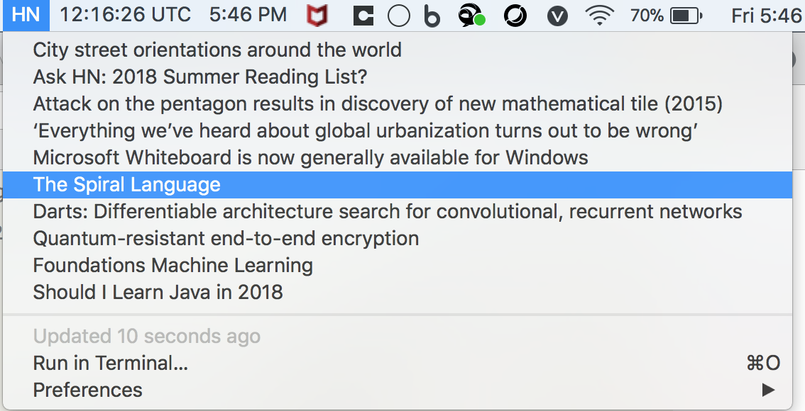

# HN Headlines - Bitbar Plugin
Bitbar Plugin for Mac to show Hacker News Headlines

### Bitbar:
Thanks to BitBar (by [Mat Ryer - @matryer](https://twitter.com/matryer)) that lets you put the output from any script/program in your Mac OS X Menu Bar.

### This Plugin:
This plugin using [Hacker News API](https://github.com/HackerNews/API) helps you put your top Hacker News (Frontpage) Headlines in your OSX Bar. 

### How to use this Plugin:

* [Download latest BitBar release](https://github.com/matryer/bitbar/releases/latest)
* **Dependency:** 
  * Make sure you have Python3 on your mac
  * Install [requests](https://github.com/requests/requests) Package using `pip3 install requests`
* Download/Copy the *hn_front.120m.py* plugin code from this repo and put it inside your Bitbar Plugin Folder
* Make sure it's executable (in Terminal, do chmod +x hn_front.120m.py)
* Then choose Refresh all from the BitBar menus

### Screenshot:

